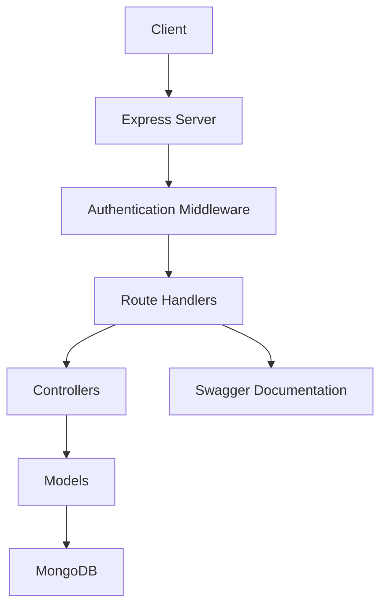

# Quest Management Backend APIs

A Node.js/Express backend application for managing user authentication, quests, and leaderboards.

## Features

- User Authentication (signup, login, logout)
- Quest Management System
- Leaderboard Tracking
- User Activity Monitoring
- API Documentation with Swagger
- Comprehensive Test Coverage

## Technology Stack

- Node.js
- Express
- MongoDB
- Jest (Testing)
- Swagger (API Documentation)
- JWT Authentication

## Prerequisites

- Node.js 14+
- MongoDB
- npm or yarn

## Installation

1. Clone the repository
2. Install dependencies:
```bash
npm install
```

3. Create a .env file in the root directory with the following variables:
```
PORT=3000
MONGODB_URI=your_mongodb_connection_string
JWT_SECRET=your_jwt_secret
```

4. Start the server:
```bash
npm start
```

For development:
```bash
npm run dev
```

## API Documentation

The API documentation is available at `/api-docs` when the server is running. It provides detailed information about all available endpoints, request/response formats, and authentication requirements.

### Main Endpoints

### Swagger API View
- GET /api-docs

#### Authentication
- POST /api/auth/signup - Create new user account
- POST /api/auth/login - User login
- POST /api/auth/logout - User logout

#### Quests
- GET /api/quests - Get all quests
- POST /api/quests - Create new quest
- PUT /api/quests/:id/progress - Update quest progress
- GET /api/quests/leaderboard - Get quest leaderboard

#### Users
- GET /api/users/:id - Get user details
- GET /api/users/activity - Get user activity

## Database Schema

### User Model
```javascript
{
  username: String,
  email: String,
  password: String (hashed),
  createdAt: Date,
  updatedAt: Date
}
```

### Quest Model
```javascript
{
  title: String,
  description: String,
  points: Number,
  status: String,
  createdAt: Date,
  updatedAt: Date
}
```

### QuestLeaderboard Model
```javascript
{
  userId: ObjectId,
  questId: ObjectId,
  score: Number,
  completedAt: Date
}
```

### UserActivity Model
```javascript
{
  userId: ObjectId,
  action: String,
  timestamp: Date,
  details: Object
}
```

## Architecture Diagram



## Testing

Run tests:
```bash
npm test
```

Run tests with coverage:
```bash
npm run test:coverage
```

## Contributing

1. Fork the repository
2. Create your feature branch
3. Commit your changes
4. Push to the branch
5. Create a new Pull Request

## License

This project is licensed under the MIT License.